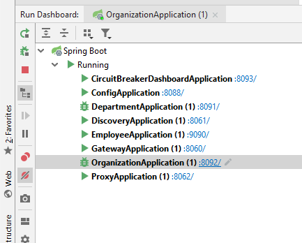

# POC Spring cloud with Netflix stack
Validate a microservices architecture with the following stack
- spring-boot 2.0.0.RELEASE
- spring-cloud Finchley.SR1
    - openfeign for rest microservices client
    - gateway
    - sleuth for log correlation rest call id
    - config server for centralized service configuration
- Netflix stack 
    - eureka for discovery service
    - hystrix for circuit breaker
    - zull for centralized swagger2 api for microservices
    

# Requirement
- Java 8
- Maven 3.3.9

# How to build ? 
Go to root project and run ```mvn clean install```

# How to run ? 
## With intellij 
- Use Run dashboard 
- Run in the following order
    - config-service
    - discovery-service
    - organization-service
    - department-service
    - employee-service
    - gateway-service
    - histrix-service
    - proxy-service
    
## Command line
### Run Configuration server
- Config service on port 8088 
    - `` cd config-service ``
    - `` mvn spring-boot:run ``

- discovery service on port 8093
    - `` cd discovery-service ``
    - `` mvn spring-boot:run ``

- organization service on port 8092
    - `` cd organization-service ``
    - `` mvn spring-boot:run ``

- department service on port 8091
    - `` cd department-service ``
    - `` mvn spring-boot:run ``

- employee service on port 9090
    - `` cd employee-service ``
    - `` mvn spring-boot:run ``

- gateway service on port 8060
    - `` cd gateway-service ``
    - `` mvn spring-boot:run ``

- histrix service on port 8093
    - `` cd histrix-service ``
    - `` mvn spring-boot:run ``

- proxy service on port 8062
    - `` cd proxy-service ``
    - `` mvn spring-boot:run ``

# Test Circuit breaker
- When all services are available
    - Go to http://localhost:8092/1/with-departments
    - The organization departments are visible

- Stop department service 
    - Go to http://localhost:8092/1/with-departments
    - The organiaztion response has no department : the rest call to departement service did not slow the microservices flow 
           
 
    
# Rest API Documentation
Go to http://localhost:8062/swagger-ui.html and select your microservices
